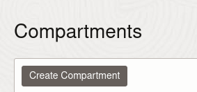

# Capítulo 7


1. [Capítulo 7](#capítulo-7)
   1. [Configuração do Ambiente](#configuração-do-ambiente)
      1. [Instalação k0s](#instalação-k0s)
      2. [Instalação do kubectl](#instalação-do-kubectl)
      3. [Criação de usuário no cluster para acesso pelo kubectl](#criação-de-usuário-no-cluster-para-acesso-pelo-kubectl)
      4. [Criação do Registry do Docker](#criação-do-registry-do-docker)
      5. [Instalação do Skaffold](#instalação-do-skaffold)
      6. [Instalação do Helm](#instalação-do-helm)
      7. [Instalação do Terraform:](#instalação-do-terraform)
   2. [Kubernetes](#kubernetes)
      1. [Criação do primeiro deployment](#criação-do-primeiro-deployment)
      2. [Criação do primeiro service](#criação-do-primeiro-service)
      3. [Criação do primeiro ingress](#criação-do-primeiro-ingress)
      4. [Implantação do NGINX Ingress](#implantação-do-nginx-ingress)
   3. [Helm](#helm)
   4. [Jib](#jib)
      1. [Gerar imagem base](#gerar-imagem-base)
      2. [Gerar imagem da aplicação](#gerar-imagem-da-aplicação)
   5. [Helm na aplicação](#helm-na-aplicação)
      1. [Criando o Helm da aplicação](#criando-o-helm-da-aplicação)
      2. [Implantando e atualizando a aplicação](#implantando-e-atualizando-a-aplicação)
      3. [Analisando a implantação](#analisando-a-implantação)
      4. [Implantando o banco de dados](#implantando-o-banco-de-dados)
   6. [Skaffold](#skaffold)
      1. [Configurando a implantação com o Skaffold](#configurando-a-implantação-com-o-skaffold)
      2. [Definindo um profile para gerar imagem no GitLab](#definindo-um-profile-para-gerar-imagem-no-gitlab)
      3. [Configurando uma pipeline para construção da imagem no GitLab](#configurando-uma-pipeline-para-construção-da-imagem-no-gitlab)
   7. [Terraform](#terraform)
      1. [Hello world](#hello-world)
      2. [Aplicar as alterações](#aplicar-as-alterações)
      3. [Gerando uma saída (output)](#gerando-uma-saída-output)
      4. [Usando locals, foreach e null\_resource](#usando-locals-foreach-e-null_resource)
      5. [Criando pipeline para aplicar o Terraform](#criando-pipeline-para-aplicar-o-terraform)
   8. [OCI](#oci)
      1. [Realizando a inscrição](#realizando-a-inscrição)
      2. [Arquitetura de referência](#arquitetura-de-referência)


## Configuração do Ambiente

### Instalação k0s

Baixar executável:
```
curl -sSLf https://get.k0s.sh | sudo sh
```

Criar cluster com um único nó:
```
sudo k0s install controller --single
```

Executar o cluster:
```
sudo k0s start
```

Usar o kubectl do próprio k0s:
```
sudo k0s kubectl COMANDO_DO_KUBECTL
```

Exemplo para listagem de nós do cluster:
```
sudo k0s kubectl get nodes
```

### Instalação do kubectl

Instalar dependências necessárias:
```
sudo apt-get update
sudo apt-get install -y apt-transport-https ca-certificates curl
```

Baixar chave GPG:
```
curl -fsSL https://packages.cloud.google.com/apt/doc/apt-key.gpg | sudo gpg --dearmor -o /etc/apt/keyrings/kubernetes-archive-keyring.gpg
```

Acrescentar repositório do kubectl:
```
echo "deb [signed-by=/etc/apt/keyrings/kubernetes-archive-keyring.gpg] https://apt.kubernetes.io/ kubernetes-xenial main" | sudo tee /etc/apt/sources.list.d/kubernetes.list
```

Instalar kubectl
```
sudo apt-get update
sudo apt-get install -y kubectl
```

### Criação de usuário no cluster para acesso pelo kubectl

Criar arquivo de configuração para um determinado usuário:
```
sudo k0s kubeconfig create --groups "system:masters" NOME_USUARIO > k0s.config
```

Criar usuário no cluster com papel de admin:
```
sudo k0s kubectl create clusterrolebinding NOME_USUARIO-binding --clusterrole=admin --user=NOME_USUARIO
```

Criar o diretório $HOME/.kube caso não exista
```
mkdir -p $HOME/.kube
```

Mover arquivo para localização padrão:

```
mv k0s.config $HOME/.kube/config
```

Definir contexto utilizado:
```
kubectl config use-context k0s
```

Ver contexto atual:
```
kubectl config current-context
```

### Criação do Registry do Docker

Rodar container:
```
docker run -d -p 5005:5000 --restart=always --name registry registry:2
```

Abrir no editor de texto o arquivo /etc/hosts:
```
sudo nano /etc/hosts
```

Adicionar registry-local na linha do localhost (127.0.1.1):
```
127.0.1.1 nome-da-maquina registry-local
```

Testar registro:
curl registry-local:5005/v2/


Gerar configuração padrão do containerd:
sudo containerd config default > containerd.toml

Alterar o arquivo para que fique assim:
```
root = "/var/lib/k0s/containerd"
state = "/var/lib/k0s/run/containerd"
...
address = "/var/lib/k0s/run/containerd.sock"
```

Acrecentar o trecho abaixo logo após `[plugins."io.containerd.grpc.v1.cri".registry.configs]`:
```
        [plugins."io.containerd.grpc.v1.cri".registry.configs."registry-local:5005".tls]
            insecure_skip_verify = true
```

E o trecho abaixo após `[plugins."io.containerd.grpc.v1.cri".registry.mirrors]`:
```
[plugins."io.containerd.grpc.v1.cri".registry.mirrors."registry-local:5005"]
          endpoint = ["http://registry-local:5005"]
        [plugins."io.containerd.grpc.v1.cri".registry.configs]
          [plugins."io.containerd.grpc.v1.cri".registry.configs."registry-local:5005".tls]
            insecure_skip_verify = true
```

Mover arquivo para diretório de configuração do k0s
```
sudo mkdir -p /etc/k0s/
sudo mv containerd.toml /etc/k0s/
```

Reiniciar serviço do k0s:
```
sudo service k0scontroller stop
sudo service k0scontroller start
```

Verificar status:
```
sudo service k0scontroller status
```


### Instalação do Skaffold

Baixar e instalar o skafold:
```
curl -Lo skaffold https://storage.googleapis.com/skaffold/releases/latest/skaffold-linux-amd64 && sudo install skaffold /usr/local/bin/
```

Checar versão:
```
skaffold version
```

Definir registry padrão, e aceitar modo inseguro:
```
skaffold config set --global default-repo registry-local:5005
skaffold config set --global insecure-registries registry-local:5005
```
Verificar configurações:
```
skaffold config list -a
```

### Instalação do Helm

Instalar helm:

```
curl -fsSL -o get_helm.sh https://raw.githubusercontent.com/helm/helm/main/scripts/get-helm-3
chmod 700 get_helm.sh
./get_helm.sh
```

Checar versão:
```
helm version
```

### Instalação do Terraform:

Adicionar chave GPG:
```
curl -fsSL https://apt.releases.hashicorp.com/gpg | sudo apt-key add -
```

Adicionar repositório do Terraform:

```
sudo sudo apt-add-repository "deb [arch=amd64] https://apt.releases.hashicorp.com $(lsb_release -cs) main"
```

Instalar Terraform:
```
sudo apt-get update && sudo apt-get install terraform
```

Verificar versão:

```
terraform -v
```

## Kubernetes

### Criação do primeiro deployment

Implantar o deployment:
```
kubectl apply -f cap-7/arquivos/kubernetes/primeiro-deployment.yaml
```

Verificar que foi implantado:
```
kubectl get deployments
```

Verificar pods criados:
```
kubectld get pods
```

### Criação do primeiro service

Implantar o service:
```
kubectl apply -f cap-07/arquivos/kubernetes/primeiro-service.yaml
```

Verificar service:
```
kubectl get services
```

Mapear porta do service para porta da máquina:

```
kubectl port-forward service/aplicacao-a 8888:80
```

### Criação do primeiro ingress

Implantar o ingress:
```
kubectl apply -f cap-07/arquivos/kubernetes/primeiro-ingress.yaml
```

Verificar ingress:
```
kubectl get ingress
```

### Implantação do NGINX Ingress

Adicionar repositório Helm:
```
helm repo add ingress-nginx https://kubernetes.github.io/ingress-nginx
helm repo update
```
Instalar o ingress NGINX
```
helm install ingress-nginx ingress-nginx/ingress-nginx 
```

Obter portas do nó nas quais o ingress está rodando:
```
kubectl describe service/ingress-nginx-controller   | grep NodePort
```

A saída será semelhante a essa:

```
NodePort:                 http  30217/TCP
NodePort:                 https  31757/TCP
```

O valor da porta http (primeira linha) será utilizado na sequencia.

Editar /etc/localhost
```
127.0.1.1 nome-da-maquina registry-local meuservico.ufscar.br
```

Acessar no navegador (trocando o `NUMERO_PORTA_HTTP` pelo valor obtido com o comando `kubectl describe`):
```
http://meuservico.ufscar.br:NUMERO_PORTA_HTTP/app-a
```


## Helm

Criar um novo chart de exemplo:

```
helm create chart
```

Implantar o chart no cluster Kubernetes:

```
helm install minha-aplicacao chart
```

Obter informações sobre a release `minha-aplicacao`:
```
helm get all minha-aplicacao   
```

Desinstalar a release:

```
helm uninstall minha-aplicacao
```

ou 

```
helm delete minha-aplicacao
```

## Jib

Adicionar na seção properties:

```xml
<jib.maven-plugin-version>3.1.4</jib.maven-plugin-version>
```

Adicionar na seção plugins:
```xml
<plugin>
	<groupId>com.google.cloud.tools</groupId>
	<artifactId>jib-maven-plugin</artifactId>
	<version>${jib.maven-plugin-version}</version>

	<configuration>
		<from>
			<image>registry-local:5005/loja-virtual-base</image>
		</from>
		<to>
			<image>registry-local:5005/loja-virtual</image>
		</to>
		<allowInsecureRegistries>true</allowInsecureRegistries>
		<container>
			<entrypoint>catalina.sh</entrypoint>
			<args>run</args>
			<jvmFlags>
				<jvmFlag>-Djava.security.egd=file:/dev/./urandom</jvmFlag>
			</jvmFlags>
			<appRoot>/usr/local/tomcat/webapps/devopsnapratica</appRoot>
			<creationTime>USE_CURRENT_TIMESTAMP</creationTime>
		</container>
	</configuration>
</plugin>
```

Alterar o arquivo ./site/pom.xml e acrescentar a dependência a seguir:

```xml
<dependency>
	<groupId>javax.annotation</groupId>
	<artifactId>javax.annotation-api</artifactId>
	<version>1.3.2</version>
</dependency>
```

### Gerar imagem base

Alterar o Dockerfile do Tomcat e comentar o trecho a seguir:

```dockerfile
ADD devopsnapratica.war /usr/local/tomcat/webapps/
```

Gerar a imagem base com o comando:

```
docker build -t registry-local:5005/loja-virtual-base .
```


Publicar a imagem no registry local (registry-local:5005):

```
docker push registry-local:5005/loja-virtual-base
```

### Gerar imagem da aplicação

Gerar imagem da aplicação com um dos comandos a seguir:

```
mvn compile package com.google.cloud.tools:jib-maven-plugin:3.2.1:build
```

```
docker run --network host -v "$(pwd)":/app -w /app -v ~/.m2:/var/maven/.m2 -v ~/.config/:/var/maven/.config -v ~/.cache:/var/maven/.cache -ti --rm -u 1000 -e MAVEN_CONFIG=/var/maven/.m2 maven:3.6.3-jdk-8 mvn -Duser.home=/var/maven -Djib.applicationCache=/app clean compile package com.google.cloud.tools:jib-maven-plugin:3.2.1:build -Djava.util.prefs.userRoot=/var/maven/.m2
```

Obter a imagem do registry:

```
docker pull registry-local:5005/loja-virtual
```

Podemos testar a imagem no Docker Compose:

```yaml
########################################################################
# Este arquivo docker-compose faz uso das imagens personalizadas
# armazenadas no Hub Docker de aurimrv. Desse modo, não foi necessário
# fazer uso dos arquivos Dockerfile individuais de cada contêiner e
# a cláusula build foi omitida.
# Para inicializar os contêiners utilizando este aquivo, estando no 
# diretório no qual este arquivo se localiza, basta executar:
#
# docker-compose -f docker-compose.yml up
#
########################################################################

version: "3.3"
services:
  db:
    image: aurimrv/mysql-server-img
    ports:
      - "3306:3306"
    volumes:
      - ./data:/var/lib/mysql

  web:
    image: registry-local:5005/loja-virtual
    ports:
      - "8080:8080"
      - "8443:8443"
    depends_on:
      - db

  monitor:
    image: aurimrv/nagios-server-img
    ports:
      - "80:80"
    depends_on:
      - web
      - db
```

## Helm na aplicação

### Criando o Helm da aplicação
Criar o chart com o comando:

```
helm create chart
```

Alterar o arquivo `chart/values.yaml` para usar a imagem gerada pelo skaffold:

```yaml
image:
  repository: registry-local:5005/loja-virtual
  pullPolicy: IfNotPresent
  # Overrides the image tag whose default is the chart appVersion.
  tag: "latest"
```

E alterar a porta utilizada pelo pod no mesmo arquivo:

```yaml
service:
  type: ClusterIP
  port: 8080
```

Alterar arquivo `chart/templates/deployment.yaml` para corrigir probes e mantê-los comentados por enquanto:

```yaml
#  livenessProbe:
#    httpGet:
#      path: /devopsnapratica
#      port: http
#    initialDelaySeconds: 60
#    periodSeconds: 15
#  readinessProbe:
#    httpGet:
#      path: /devopsnapratica
#      port: http
#    initialDelaySeconds: 10
#    periodSeconds: 5      
#
```

### Implantando e atualizando a aplicação
Implantar a aplicação com o Helm:

```
helm install loja-virtual chart
```

Sempre que houver alterações usar o comando de upgrade:

```
helm upgrade loja-virtual chart
```

### Analisando a implantação

Analisar situação do deployment:

```
kubectl describe deployments/loja-virtual-chart
```

E do pod:
```
kubectl describe pods/loja-virtual-chart-NUMERO_POD
```

Ver logs do pod:
```
kubectl logs pods/loja-virtual-chart-NUMERO_POD
```

### Implantando o banco de dados

Não é possível conectar com o banco de dados. Precisamos definir o deployment do banco de dados (chart/templates/db-deployment.yaml):

```yaml
apiVersion: apps/v1
kind: Deployment
metadata:
  name: loja-virtual-db
  labels:
    app.kubernetes.io/instance: loja-virtual
    app.kubernetes.io/name: db
spec:
  replicas: 1
  selector:
    matchLabels:
      app.kubernetes.io/instance: loja-virtual
      app.kubernetes.io/name: db
  template:
    metadata:
      labels:
        app.kubernetes.io/instance: loja-virtual
        app.kubernetes.io/name: db
    spec:
      serviceAccountName: {{ include "chart.serviceAccountName" . }}
      containers:
        - name: mysql
          image: "{{ .Values.db.image.repository }}:{{ .Values.db.image.tag | default .Chart.AppVersion }}"
          imagePullPolicy: {{ .Values.db.image.pullPolicy }}
          ports:
            - name: mysql
              containerPort: {{ .Values.db.service.port }}
              protocol: TCP
          livenessProbe:
            exec:
              command:
              - "bash" 
              - "-c"
              - "mysql --user=${MYSQL_USER} --password=${MYSQL_PASSWORD} --execute=\"SHOW DATABASES;\""
          readinessProbe:
            exec:
              command:
              - "bash" 
              - "-c"
              - "mysql --user=${MYSQL_USER} --password=${MYSQL_PASSWORD} --execute=\"SHOW DATABASES;\""
          resources:
            {{- toYaml .Values.db.resources | nindent 12 }}
      {{- with .Values.db.nodeSelector }}
      nodeSelector:
        {{- toYaml . | nindent 8 }}
      {{- end }}
      {{- with .Values.db.affinity }}
      affinity:
        {{- toYaml . | nindent 8 }}
      {{- end }}
      {{- with .Values.db.tolerations }}
      tolerations:
        {{- toYaml . | nindent 8 }}
      {{- end }}


```

E definir um *service* (chart/templates/db-service.yaml), o qual será utilizado pelo *pod* da aplicação da loja para se conectar ao banco de dados:

```yaml
apiVersion: v1
kind: Service
metadata:
  name: db
  labels:
    {{- include "chart.labels" . | nindent 4 }}
spec:
  type: {{ .Values.db.service.type }}
  ports:
    - port: {{ .Values.db.service.port }}
      targetPort: mysql
      protocol: TCP
      name: mysql
      
  selector:
    app.kubernetes.io/instance: loja-virtual
    app.kubernetes.io/name: db

```
Também é necessário definir os valores utilizados no arquivo `chart/values.yaml`:

```yaml
db:
  nodeSelector: {}
  tolerations: []
  affinity: {}
  resources: {}
  service:
    type: ClusterIP
    port: 3306
  image:
    repository: aurimrv/mysql-server-img
    pullPolicy: IfNotPresent
    # Overrides the image tag whose default is the chart appVersion.
    tag: "latest"
```

Descomentar os probes no deployment.yaml e configurar parâmeotrs deles:

```yaml
livenessProbe:
  httpGet:
    path: /devopsnapratica
    port: http
  timeoutSeconds: 1
  periodSeconds: 10
  successThreshold: 1
  failureThreshold: 10
readinessProbe:
  httpGet:
    path: /devopsnapratica
    port: http
  timeoutSeconds: 1
  periodSeconds: 10
  successThreshold: 1
  failureThreshold: 3
```

Atualizar a release:

```
helm upgrade loja-virtual
```

## Skaffold

### Configurando a implantação com o Skaffold

Precisamos agora definir o arquivo `skaffold.yaml` na raíz do projeto:

```yaml
#Versão da API e tipo
apiVersion: skaffold/v3
kind: Config
#Configuração da geração de imagens
build:
  # Usar o SHA do commit como tag da imagem
  tagPolicy:
    gitCommit:
      variant: CommitSha
      # ignoreChanges: true
  #Imagens geradas
  artifacts:
    # Imagem gerada pelo Dockerfile (docker-img/web/Dockerfile)
    - image: registry-local:5005/loja-virtual-base
      context: ./docker-img/web
    # imagem gerada pelo jib
    - image: registry-local:5005/loja-virtual
      requires:
        - image: registry-local:5005/loja-virtual-base
      jib:
        project: combined
        fromImage: "registry-local:5005/loja-virtual-base"
  local:
    # Não utiliza o cliente do docker, e sim a API do Docker Engine
    useDockerCLI: false
    # Usa o Buildkit (https://docs.docker.com/develop/develop-images/build_enhancements/)
    useBuildkit: false

deploy:
  # Tempo de espera para a realização do deploy
  statusCheckDeadlineSeconds: 2400
  # Configuração do Helm para implantação
  helm:
    # Configuração das Releases
    releases:
      # Release local para desenvolvimento
      - name: loja-virtual
        # Localização do chart do Helm
        chartPath: chart
        # Arquivos de valores utilizados
        valuesFiles: [chart/values.yaml]
        # Passa o nome da imagem como parâmetro para o Helm
        # Substitui os valores image.repository e image.tag no chart com o valor da imagem gerada no artifact (nome sanitizado).
        # Ver https://skaffold.dev/docs/deployers/helm/#sanitizing-the-artifact-name-from-invalid-go-template-characters
        setValueTemplates:
          image.repository: "{{.IMAGE_REPO_registry_local_5005_loja_virtual}}"
          image.tag: "{{.IMAGE_TAG_registry_local_5005_loja_virtual}}"
        namespace: loja-virtual
        # Cria o namespace caso não exista
        createNamespace: true
    # Flags passadas para o helm
    flags:
      # No upgrade, tem timeout de 35 minutos
      upgrade: ["--timeout", "35m0s"]
      # Na instalação, tem timeout de 35 minutos
      install: ["--timeout", "35m0s"]
  # Contexto do kubernetes utilizado
  kubeContext: k0s

```

Para testar a implantação com o skaffold, devemos executar o comando `skaffold dev` no diretório onde está o arquivo skaffold.yaml (raíz):

```shell
skaffold dev
```

### Definindo um profile para gerar imagem no GitLab

Devemos configurar agora um profile, para alterar o nome da imagem gerada quando a pipeline for executada no GitLab. Isso é realizado alterando o arquivo `skaffold.yaml`:

```yaml
profiles:
  - name: gitlab
    patches:
      - op: replace
        path: /build/artifacts/0/image
        value: 'registry.gitlab.com/forks-bl2/loja-virtual-devops/loja-virtual-base'
      - op: replace
        path: /build/artifacts/1/image
        value: 'registry.gitlab.com/forks-bl2/loja-virtual-devops/loja-virtual'
```

### Configurando uma pipeline para construção da imagem no GitLab


Configurar a pipeline para construção da imagem:

```yaml
#### Jobs referentes ao Skaffold
# Job responsável por gerar a imagem da aplicação que será utilizada no Kubernetes
skaffold-build:
  image: maven:3.6.3-openjdk-8-slim
  stage: build
  before_script:
    - apt-get update && apt-get install -y apt-transport-https ca-certificates curl gnupg lsb-release
    - curl -fsSL https://download.docker.com/linux/debian/gpg | gpg --dearmor -o /usr/share/keyrings/docker-archive-keyring.gpg
    - echo "deb [arch=amd64 signed-by=/usr/share/keyrings/docker-archive-keyring.gpg] https://download.docker.com/linux/debian $(lsb_release -cs) stable" |  tee /etc/apt/sources.list.d/docker.list > /dev/null
    - apt-get update && apt-get install docker-ce docker-ce-cli containerd.io -y
    - docker login -u gitlab-ci-token -p $CI_JOB_TOKEN $CI_REGISTRY
    - curl -Lo skaffold https://storage.googleapis.com/skaffold/releases/latest/skaffold-linux-amd64
    - install skaffold /usr/local/bin/
    - curl https://raw.githubusercontent.com/helm/helm/main/scripts/get-helm-3 | bash
  script:
    - skaffold build -p gitlab --file-output=tags.json --cache-artifacts=true --cache-file="$HOME/.skaffold/cache" --remote-cache-dir="$HOME/.skaffold/repos"
```


## Terraform

### Hello world

Vamos criar um diretório específico para os arquivos do Terraform:

```yaml
mkdir ~/kubernetes/terraform
```

Criar arquivo `main.tf`:

```
# Summary: Criar e gerenciar arquivo local.

# Documentation: https://www.terraform.io/docs/language/settings/index.html
terraform {
  required_version = ">= 1.5.0"
}

# Documentation: https://registry.terraform.io/providers/hashicorp/local/latest/docs/resources/file
resource "local_file" "local_file_hello" {
  content  = "Hello terraform local!"
  filename = "${path.module}/local_file_hello_${terraform.workspace}.txt"
}

```

### Aplicar as alterações

Iniciar o terraform:

```shell
terraform init
```

Verificar o plano com o comando a seguir:

```shell
terraform plan
```

Aplicar as alterações:

```shell
terraform apply -auto-approve
```

Verificar novamente o plano:
```shell
terraform plan
```

### Gerando uma saída (output) 

Acrescentar no arquivo main.tf:

```terraform
# Documentation: https://registry.terraform.io/providers/hashicorp/local/latest/docs/data-sources/file
data "local_file" "changeme_local_file_preexisting_file" {
  filename = "${path.module}/local_file_hello_${terraform.workspace}.txt"
}

# Documentation: https://www.terraform.io/docs/language/values/outputs.html
output "changeme_preexisting_file_content" {
  value = data.local_file.changeme_local_file_preexisting_file.content
}
```

### Usando locals, foreach e null_resource

```terraform
# Documentation: https://www.terraform.io/docs/language/values/locals.html
locals {
  # Documentation: https://www.terraform.io/docs/language/expressions/types.html#maps-objects
  map1 = {
    item1 = {
      name1 = "item1value1"
      name2 = "item1value2"
    }
    item2 = {
      name1 = "item2value1"
      name2 = "item2value2"
    }
  }
}

# Documentation: https://registry.terraform.io/providers/hashicorp/null/latest/docs/resources/resource
resource "null_resource" "changeme_null_resource_foreach" {
  # Documentation: https://www.terraform.io/docs/language/meta-arguments/for_each.html
  for_each = local.map1
  # Documentation: https://www.terraform.io/docs/language/resources/provisioners/local-exec.html
  provisioner "local-exec" {
    command = "echo ${each.key} ${each.value.name1} ${each.value.name2}"
  }
}
```

Aplicar as alterações:

```shell
terraform apply -auto-approve
```

### Criando pipeline para aplicar o Terraform

Adicionar variáveis de ambiente usadas para jobs do Terraform
```yaml
variables:
  # Diretório com as configurações utilizadas pelo Terraform para realizar o
  # provisionamento e gerenciamento da infraestrutura necessária para execução
  # da aplicação em um provedor de nuvem.
  TF_ROOT: terraform

  # Nome do state do Terraform
  TF_STATE_NAME: loja-virtual-prod

```

Adicionar estágios específicos para a infraestrutura:

```yaml
stages:
  - init-cloud-infrastructure
  - plan-cloud-infrastructure
  - apply-cloud-infrastructure
```

Adicionar jobs do Terraform:

```yaml
#### Jobs referentes ao Terraform
# (https://gitlab.com/gitlab-org/gitlab/blob/master/lib/gitlab/ci/templates/Terraform.gitlab-ci.yml)

# Job responsável por inicializar o plano do Terraform
init-cloud-infrastructure:
  stage: init-cloud-infrastructure
  image:
    name: "$CI_TEMPLATE_REGISTRY_HOST/gitlab-org/terraform-images/releases/1.4:v1.0.0"
  script:
    - gitlab-terraform init

# Job responsável por validar o plano do Terraform
validate-cloud-infrastructure:
  image:
    name: "$CI_TEMPLATE_REGISTRY_HOST/gitlab-org/terraform-images/releases/1.4:v1.0.0"
  stage: init-cloud-infrastructure

  extends: .terraform:validate
  needs: []

# Job responsável por construir o plano do Terraform
plan-cloud-infrastructure:
  image:
    name: "$CI_TEMPLATE_REGISTRY_HOST/gitlab-org/terraform-images/releases/1.4:v1.0.0"
  extends: .terraform:build
  environment:
    name: $TF_STATE_NAME
    action: prepare
  stage: plan-cloud-infrastructure

# Job responsável por aplicar o plano do Terraform no provedor de nuvem (OCI)
apply-cloud-infrastructure:
  image:
    name: "$CI_TEMPLATE_REGISTRY_HOST/gitlab-org/terraform-images/releases/1.4:v1.0.0"
  extends: .terraform:deploy
  dependencies:
    - plan-cloud-infrastructure
  environment:
    name: $TF_STATE_NAME
    action: start
  before_script:
    - mkdir -p /.oci/
    - chmod 700 /.oci/
    - echo "$PRIVATE_API_KEY" | tr -d '\r' >> /.oci/oci_api_key.pem
  stage: apply-cloud-infrastructure
```


## OCI

### Realizando a inscrição


Realizar a inscrição:

https://signup.cloud.oracle.com/

Confirmar e-mail:


Definir senha:


Informar endereço:


Adicionar método de pagamento:


Selecionar cartão de crédito:


Preencher informações de pagamento:


Informações adicionadas com sucesso:


Verificação de pagamento:


Aceitar contrato:


Selecionar compartments:


Criar compartment:



Preencher informações do compartment:


Compartment criado:


### Arquitetura de referência

Arquitetura de referência:

https://docs.oracle.com/en/solutions/deploy-cloud-native-apps/index.html#GUID-6AF8F67C-E1E6-4211-8156-DA2001614E2D

